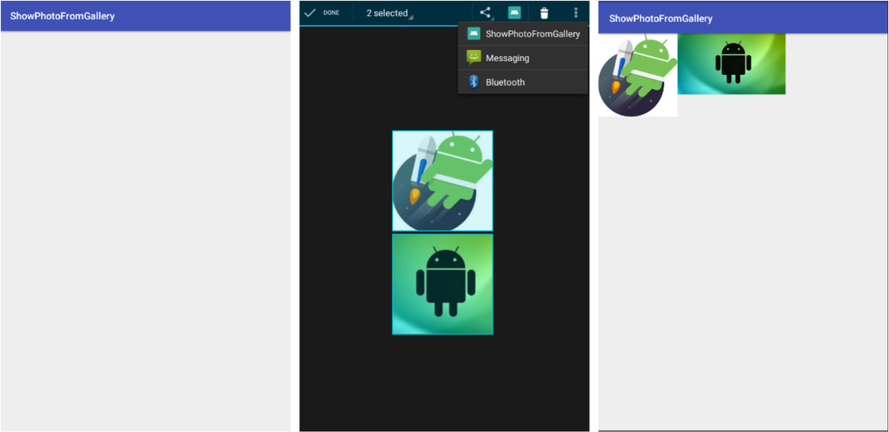

# ShowPhotoFromGallery
This is a sample to show photos that are selected and shared from gallery in Android. Photo can be selected as singe or multiple from gallery to
shared an application in phone. To appear the application in list that is showed when click the share button, AndroidManifest.xml is
updated with these intent-filter. One for single photo and one for multiple photos orderly.

```
<intent-filter>
  <action android:name="android.intent.action.SEND" />
  <category android:name="android.intent.category.DEFAULT" />
  <data android:mimeType="image/*" />
</intent-filter>
<intent-filter>
  <action android:name="android.intent.action.SEND_MULTIPLE" />
  <category android:name="android.intent.category.DEFAULT" />
  <data android:mimeType="image/*" />
</intent-filter>
```

To handle the content delivered, intent is used in MainActivity.java.There are some differences between single and multiple. If one photo
being shared, it casts Uri. Differently, content casts Uri list while multiple photo being shared.

Intent.ACTION_SEND is used to handle single photo and Intent.ACTION_SEND_MULTIPLE is used to handle multiple photos.

```java
if (Intent.ACTION_SEND.equals(action) && type != null) {
            if (type.startsWith("image/")) {
                //Handle one image from gallery
                Uri imageUri = (Uri) intent.getParcelableExtra(intent.EXTRA_STREAM);
                Bitmap bitmap = null;
                try {
                    bitmap = MediaStore.Images.Media.getBitmap(this.getContentResolver(), imageUri);
                } catch (IOException e) {
                    e.printStackTrace();
                }
                iv1.setImageBitmap(bitmap);
            }
        } else if (Intent.ACTION_SEND_MULTIPLE.equals(action) && type != null) {
            if (type.startsWith("image/")) {
                //Handle share multiple image from gallery
                ArrayList<Uri> imageUris = intent.getParcelableArrayListExtra(Intent.EXTRA_STREAM);
                if(imageUris != null && imageUris.size() > 0){
                    for (int i=0;i<imageUris.size();i++){
                        Bitmap bitmap = null;
                        try {
                            bitmap = MediaStore.Images.Media.getBitmap(this.getContentResolver(), imageUris.get(i));
                        } catch (IOException e) {
                            e.printStackTrace();
                        }
                        ivList.get(i).setImageBitmap(bitmap);
                    }
                }
            }
        }
```

Screen shots:


